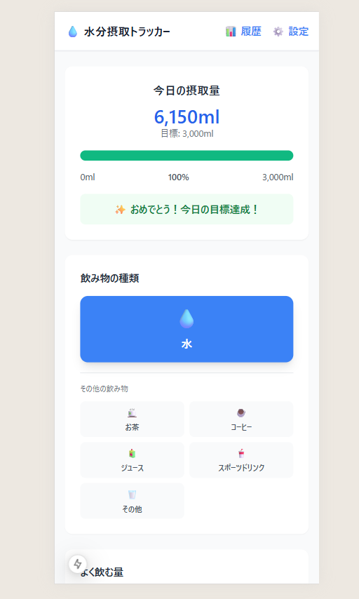

# 💧 水分摂取トラッカー

**Next.js 15 + TypeScript + Tailwind CSS v3** で構築された、シンプルで実用的な水分摂取管理アプリです。

<!-- アプリのキャプチャ画像をここに配置予定 -->


## ✨ 主な機能

### 🎯 水分摂取管理
- **6種類の飲み物対応**: 水・お茶・コーヒー・ジュース・スポーツドリンク・その他
- **プリセット量ボタン**: 200ml, 350ml, 500ml, 1000ml
- **自由入力**: カスタム摂取量の記録
- **リアルタイム進捗**: 目標達成率と残り必要量を表示

### 📊 統計・履歴機能
- **期間別分析**: 1週間・1ヶ月・全期間の統計
- **視覚的グラフ**: 日別摂取量・達成率推移（Recharts使用）
- **詳細統計**: 平均摂取量・最高摂取量・達成日数・達成率

### ⚙️ カスタマイズ設定
- **自動目標計算**: 体重と活動量に基づく推奨摂取量算出
- **手動目標設定**: カスタム目標量の設定
- **データ管理**: 記録削除・設定リセット機能

### 📱 PWA対応
- **レスポンシブデザイン**: モバイル最適化済み
- **アプリライクUI**: ネイティブアプリのような操作感
- **オフライン対応準備**: マニフェスト設定完了

## 🚀 技術スタック

- **フレームワーク**: Next.js 15 (App Router)
- **言語**: TypeScript
- **スタイリング**: Tailwind CSS v3
- **データ可視化**: Recharts
- **データ永続化**: LocalStorage
- **開発環境**: ESLint, PostCSS, Autoprefixer

## 📦 セットアップ

### 前提条件
- Node.js 18+
- npm または yarn

### インストール手順

1. **リポジトリのクローン**
   ```bash
   git clone https://github.com/takamiya1021/app015-cc-water-tracher.git
   cd app015-cc-water-tracker
   ```

2. **依存関係のインストール**
   ```bash
   npm install
   ```

3. **開発サーバーの起動**
   ```bash
   npm run dev
   ```

4. **ブラウザでアクセス**
   ```
   http://localhost:3000
   ```

## 🛠️ 利用可能なコマンド

```bash
# 開発サーバー起動
npm run dev

# 本番ビルド
npm run build

# 本番サーバー起動
npm run start

# コード品質チェック
npm run lint
```

## 📱 使い方

### 1. 水分摂取の記録
1. **飲み物の種類選択**: 水（メイン）または他の飲み物を選択
2. **摂取量の入力**: プリセットボタンまたはカスタム入力
3. **記録追加**: 「追加」ボタンで記録を保存

### 2. 進捗の確認
- **メイン画面**: 今日の摂取量・目標達成率・残り必要量
- **履歴画面**: 期間別統計・グラフ・詳細データ

### 3. 目標設定の調整
1. **設定画面**にアクセス
2. **自動計算**: 体重・活動量を入力して推奨摂取量を算出
3. **カスタム設定**: 手動で目標摂取量を設定

## 🎨 UI/UXの特徴

### 水分摂取に特化したデザイン
- **水を最優先**: 大きな水ボタンで直感的操作
- **視覚的フィードバック**: 進捗バーと色分けで達成状況を明示
- **タッチファーストUI**: モバイル操作に最適化された44px+ボタン

### ユーザビリティ重視
- **ワンタップ記録**: よく使う量はワンタップで記録
- **安全な削除**: ホバー表示+確認モーダルで誤操作防止
- **リアルタイム更新**: 記録と同時に全データが即座に更新

## 🗂️ プロジェクト構成

```
src/
├── app/              # Next.js App Router
│   ├── page.tsx      # メインページ（水分摂取記録）
│   ├── history/      # 履歴・統計ページ
│   ├── settings/     # 設定ページ
│   └── layout.tsx    # 共通レイアウト・PWA設定
├── lib/              # ビジネスロジック
│   ├── storage.ts    # LocalStorage操作・データマイグレーション
│   └── calculations.ts # 統計計算・目標算出・進捗ヘルパー
└── types/            # TypeScript型定義
    └── index.ts      # 全型定義・定数・デフォルト設定
```

## 📊 データ管理

### LocalStorage構造
- **摂取記録**: 日付別・時刻順でソート保存
- **設定情報**: 目標設定・ユーザー設定
- **バージョン管理**: データマイグレーション対応（現在 v1.1.0）

### データマイグレーション
- **下位互換性**: 既存データを維持しながら新機能追加
- **自動マイグレーション**: アプリ起動時に自動実行
- **エラーハンドリング**: データ破損時の復旧機能

## 🌟 今後の拡張予定

- **サービスワーカー**: 完全オフライン対応
- **飲み物別統計**: カテゴリ別摂取量分析
- **リマインダー機能**: 定期的な水分摂取通知
- **データエクスポート**: CSV・JSON形式での出力

## 📝 開発ドキュメント

### 設計ドキュメント
- [要件定義書](./doc/要件定義書.md)
- [技術設計書](./doc/技術設計書.md)
- [実装計画書](./doc/実装計画書.md)

### 開発進捗
- **総合完成度**: 99%
- **主要機能**: 完全実装済み
- **テスト状況**: 動作確認済み・エラーフリー

## 🤝 コントリビューション

Issue や Pull Request を歓迎します！

1. Fork the repository
2. Create your feature branch (`git checkout -b feature/amazing-feature`)
3. Commit your changes (`git commit -m 'Add some amazing feature'`)
4. Push to the branch (`git push origin feature/amazing-feature`)
5. Open a Pull Request

## 📄 ライセンス

This project is licensed under the MIT License.

## 🙏 謝辞

- **Next.js**: 最新のReact開発体験を提供
- **Tailwind CSS**: 高速でレスポンシブなスタイリング
- **Recharts**: 美しいデータ可視化
- **TypeScript**: 型安全な開発環境

---

**作成日**: 2025年9月14日
**ステータス**: 完成・本番運用可能
**バージョン**: v1.1.0